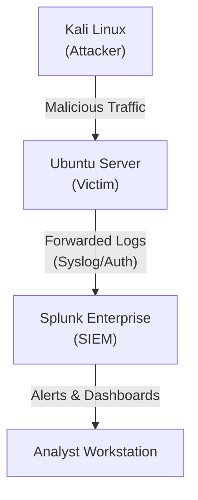

# Cybersecurity Homelab & Detection Engineering Portfolio

## 📋 Executive Summary
This repository serves as a technical portfolio documenting my journey in **Cybersecurity Operations** and **Detection Engineering**. It demonstrates the practical application of security concepts in a controlled homelab environment, bridging the gap between offensive simulations (Red Team) and defensive analysis (Blue Team).

The primary goal of this project is to simulate real-world cyber threats to develop high-fidelity detection rules, practice incident response procedures according to **NIST SP 800-61**, and master log analysis using **Splunk Enterprise**.

## 🏗️ Lab Architecture
The environment is built using a Type-2 Hypervisor approach (VirtualBox/VMware), simulating a small corporate network under attack.

* **Attacker Node:** Kali Linux (2024.x) - Equipped with Nmap, Hydra, Metasploit.
* **Victim Node:** Ubuntu Server / Metasploitable - Hosting vulnerable services (SSH, FTP, HTTP).
* **SIEM Node:** Splunk Enterprise - Centralized log management and correlation.

🛠️ Technical Skills Demonstrated

    Security Operations (SOC): Log analysis, Triage, Incident Reporting.

    SIEM Engineering: SPL (Search Processing Language), Field Extraction, Dashboarding.

    Detection as Code: Writing Sigma rules, mapping events to MITRE ATT&CK.

    Vulnerability Management: Identifying and exploiting common misconfigurations.

📂 Portfolio Scenarios (Case Studies)

Each scenario includes a detailed report covering the attack execution, detection logic, and mitigation strategies.
ID	Scenario Name	MITRE Technique	Tools Used	Status
Lab-01	Network Reconnaissance Detection	T1046 (Network Service Discovery)	Nmap, Splunk	📅 Planned
Lab-02	SSH Brute Force Analysis	T1110 (Brute Force)	Hydra, Syslog	📅 Planned
Lab-03	User Account Creation Monitoring	T1136 (Create Account)	Useradd, Auth.log	📅 Planned
Lab-04	Web Server Fuzzing Detection	T1190 (Exploit Public-Facing App)	Nikto, Apache Logs	📅 Planned
Lab-20	Full Kill Chain Investigation	APT Simulation	Multiple	📅 Planned
📁 Repository Structure

The project is organized to mimic a professional documentation repository:
Plaintext

/cybersecurity-homelab-portfolio
│
├── README.md                   # You are here
├── /labs                       # Detailed lab reports
│   ├── 01-nmap-scan/           # Scenario 1 documentation
│   └── 02-ssh-brute-force/     # Scenario 2 documentation
│
├── /configs                    # Configuration files
│   ├── splunk/                 # inputs.conf, props.conf examples
│   └── scripts/                # Automation scripts (bash/python)
│
└── /detection-rules            # Sigma rules (YAML) repository

🚀 Methodology

For every simulated scenario, I follow a structured Purple Team workflow:

    Emulate: Execute the attack using standard Red Team tools.

    Ingest: Ensure relevant logs are captured by Splunk.

    Analyze: Hunt for Indicators of Attack (IoA) using SPL.

    Detect: Create a correlation rule to alert on the behavior.

    Document: Report findings using a NIST-aligned template.

⚠️ Disclaimer

All activities documented in this repository were performed in a strictly controlled, isolated environment (Homelab) owned by me. The techniques described are for educational purposes only.

Created by [Twoje Imię] - Aspiring SOC Analyst / Detection Engineer Connect with me on LinkedIn

---

### Co ten plik robi dla Ciebie?

1.  **Badges (Odznaki):** Te kolorowe prostokąty na górze od razu przyciągają wzrok i mówią "to jest nowoczesny projekt".
2.  **Mermaid Diagram:** Kod `graph TD` automatycznie wygeneruje schemat Twojej sieci. To wygląda bardzo profesjonalnie (GitHub to renderuje).
3.  **Tabela Scenariuszy:** To jest serce Twojego portfolio. Rekruter widzi tabelę i klika w "SSH Brute Force Analysis".
4.  **Słowa kluczowe:** Tekst jest napakowany słowami pod systemy ATS (rekrutacyjne boty): *SOC, SIEM, SPL, MITRE, NIST, Detection Engineering*.

### Co musisz zmienić po wklejeniu?
* W sekcji `Created by` wpisz swoje Imię i Nazwisko.
* W sekcji `Connect with me` wklej link do swojego LinkedIna.
* W tabeli `Portfolio Scenarios` linki (np. `./labs/01-nmap-scan`) muszą zgadzać się z nazwami folderów, które faktycznie stworzysz.